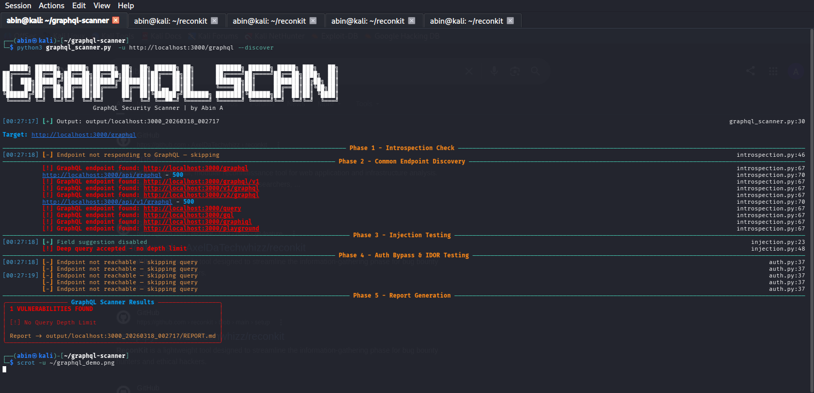

# GraphQL Scanner
> GraphQL Security Testing Tool for Bug Bounty & Penetration Testing

Built by Abin A - automates the most critical GraphQL
security checks found in real-world bug bounty programs.

## What It Tests
| # | Test | Description |
|---|------|-------------|
| 1 | Introspection | Checks if schema enumeration is enabled |
| 2 | Endpoint Discovery | Finds common GraphQL endpoints |
| 3 | Field Suggestion | Detects information leak via suggestions |
| 4 | Batch Query Abuse | Tests for DoS via batch queries |
| 5 | Query Depth | Checks for missing depth limits |
| 6 | Auth Bypass | Tests unauthenticated data access |

## Installation
```bash
git clone https://github.com/abinsolo/graphql-scanner
cd graphql-scanner
pip3 install -r requirements.txt
Usage
# Full scan
python3 graphql_scanner.py -u http://target.com/graphql

# With endpoint discovery
python3 graphql_scanner.py -u http://target.com --discover

# With auth token
python3 graphql_scanner.py -u http://target.com/graphql --header "Authorization: Bearer <token>"

# Skip specific tests
python3 graphql_scanner.py -u http://target.com/graphql --skip-auth
python3 graphql_scanner.py -u http://target.com/graphql --skip-injection
Test Against Juice Shop
sudo docker run -d -p 3000:3000 bkimminich/juice-shop
python3 graphql_scanner.py -u http://localhost:3000/api/graphql --discover

#Demo


Legal
Only test targets you have explicit permission to test.
Author
Abin A - Bug Bounty Researcher | Penetration Tester
LinkedIn: linkedin.com/in/abin-a-937196382
GitHub: github.com/abinsolo
TryHackMe: tryhackme.com/p/Abinsolo
